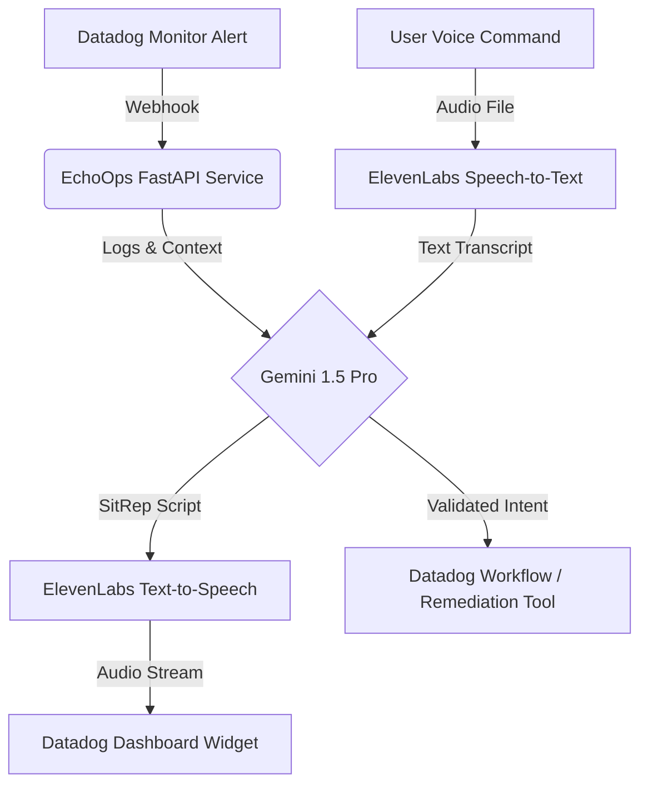

# Project Proposal: EchoOps - "The System That Speaks"

## 1. The Concept
**EchoOps** is an ambient computing interface for DevOps. It transforms Datadog from a visual dashboard into an **active voice participant** in the war room. By chaining **Datadog Signals**, **Gemini 2.5 Flash Lite**, and **ElevenLabs**, it allows engineers to *hear* the root cause of an incident and *speak* the remediation, drastically reducing Mean Time To Resolution (MTTR).

> **Elevator Pitch**: "Iron Man's JARVIS for Site Reliability Engineers."

---

## 2. Architecture & Data Flow

### Key Integrations
1.  **Datadog**: 
    -   **Trigger**: Webhooks from Monitors.
    -   **Visualization**: Custom IFrame Widget for the "Voice Console".
    -   **Action**: Datadog Workflows triggered via API to execute infrastructure changes.
2.  **Google Vertex AI (Gemini 2.5 Flash Lite)**:
    -   **Task 1**: Correlates alert data with recent logs to write a concise "Situation Report".
    -   **Task 2**: Validates high-stakes voice commands (e.g., preventing accidental DB drops).
3.  **ElevenLabs**:
    -   **Role**: The Interface.
    -   **Model**: *Turbo v2* for sub-second latency.
    -   **Voice**: "Brian" (Deep, authoritative, calm) for Incident Comms.

---

## 3. Compliance & Scoring Matrix

| Criteria | EchoOps Strategy |
| :--- | :--- |
| **Deep Tech Implementation** | NOT just a wrapper. Uses **Function Calling** in Gemini to map natural language to specific Datadog API payloads. |
| **Actionable Item** | The loop is closed: Alert -> Voice -> **Physical Remediation** (Scaling/Restarting). This answers the "So what?" question perfectly. |
| **Design / UX** | Innovative "Hands-Free" UX. Great for mobile on-call scenarios. |
| **Impact** | Solves "Alert Fatigue". Audio is harder to ignore than a Slack notification but less stressful than a phone call. |
| **Bonus: Multi-Partner** | Using Google + Datadog + ElevenLabs triples the "wow" factor for judges. |

---

## 4. Implementation Plan

### Phase 1: The "SitRep" Engine (The Brain)
-   [x] **FastAPI Service**: Accepts Datadog Webhook payload.
-   [x] **Log Fetcher**: Pulls the last 5 minutes of logs for the alerted service (using `ddtrace` context).
-   [x] **Gemini Prompt**: "You are a Senior SRE. Summarize this JSON alert and these logs into a 3-sentence Situation Report suitable for speech synthesis. Focus on Root Cause."

### Phase 2: The "Voice" (The Interface)
-   [x] **TTS Generation**: Send Gemini's text to ElevenLabs `text-to-speech` API.
-   [x] **Dashboard Widget**: A simple HTML/JS widget hosted on the FastAPI server, embedded in a Datadog Dashboard IFrame. It plays the generated MP3s automatically.

### Phase 3: The "Command" (The Action)
-   [x] **Command Ingest**: Endpoint to receive voice/text input.
-   [x] **Intent Mapping**: Gemini maps "Restart the pod" -> `kubectl delete pod` (via Datadog Workflow).
-   [x] **Safety Layer**: EchoOps asks for confirmation if the confidence score is < 0.9 or the action is destructive.

---

## 5. Winning Demo Script (3 Minutes)

**0:00 - 0:30**: *The Incident*
-   Visual: A quiet dashboard. Suddenly, a Monitor turns RED.
-   Audio: (EchoOps Voice) *"Attention. High latency detected in the Payment Service. Error logs indicate a Timeout Exception connecting to the User Database."*

**0:30 - 1:30**: *The Diagnosis*
-   Visual: Agent opens a trace in Datadog.
-   Action: Agent speaks: *"Echo, what changed in the last 15 minutes?"*
-   Audio: *"A deployment to the User Service tagged 'v2.4' was completed 12 minutes ago. This coincides with the latency spike."*

**1:30 - 2:30**: *The Resolution*
-   Action: Agent speaks: *"Echo, roll back the User Service to v2.3."*
-   Audio: *"Confirming rollback of User Service to stable version 2.3. Executing now."*
-   Visual: Monitor turns GREEN.

**2:30 - 3:00**: *The Audit*
-   Visual: Show the "Case" created in Datadog with the full voice transcript and action log.
