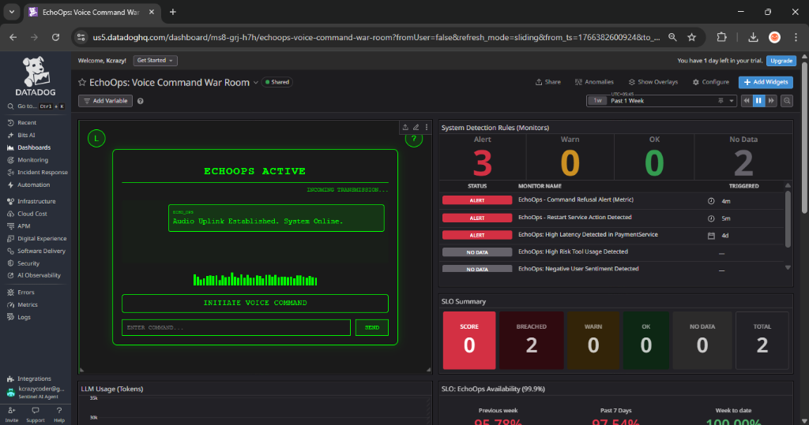
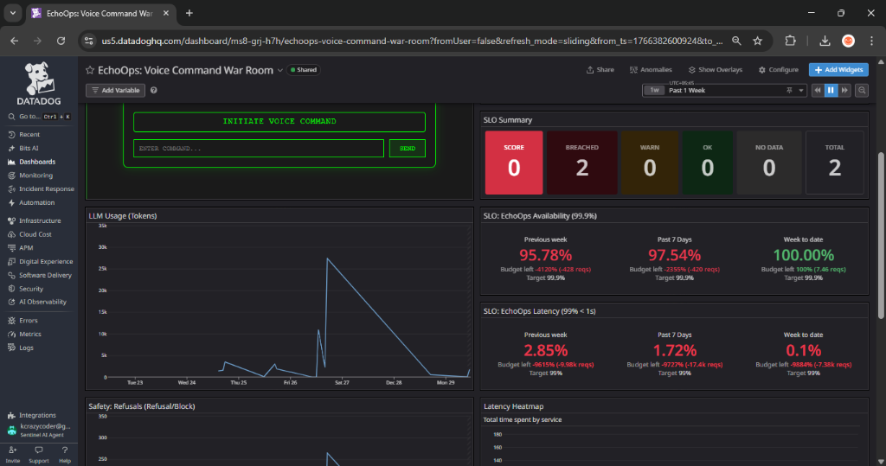
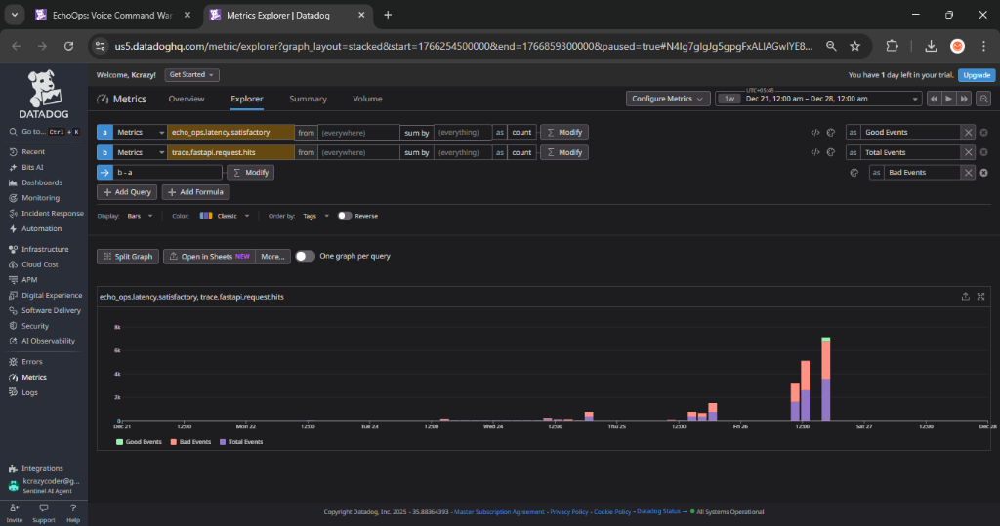

# EchoOps - "The System That Speaks"

**EchoOps** is an ambient computing interface for DevOps. It transforms Datadog from a visual dashboard into an **active voice participant** in your war room.

By chaining **Datadog Signals**, **Google Gemini 2.5 Flash Lite**, and **ElevenLabs**, EchoOps allows engineers to *hear* the root cause of an incident and *speak* the remediation, drastically reducing Mean Time To Resolution (MTTR).

> 🏆 Built for the **AI Partner Catalyst Hackathon**. [Read Submission Notes](submission_notes.md)

## 🚀 Features

-   **Voice-Enabled Incidents**: Transforms Datadog Webhook payloads into concise, audible "Situation Reports" (SitReps) using Gemini 2.5 Flash Lite.
-   **High-Fidelity Audio**: Uses ElevenLabs *Turbo v2* model for sub-second text-to-speech generation.
-   **Active Remediation**: Accepts voice commands (simulated via API) to trigger infrastructure changes.
-   **Observability First**: Full `ddtrace` integration for every voice generation step.

## 🧠 How It Works
    
The system operates in a closed loop with Datadog:
    
### 1. The Ingest Flow (Traffic → Datadog)
*   **Traces**: The service uses `ddtrace` to automatically report every request to Datadog APM.
*   **Metrics**: Custom counters (e.g., `echo_ops.intent.refusal`) are sent using `statsd`, immediately populating dashboards.
    
### 2. The Trigger Flow (Datadog → EchoOps)
*   **Alert**: A Datadog Monitor (e.g., Latency > 500ms) detects an anomaly.
*   **Webhook**: The Monitor hits the `.../webhook/datadog` endpoint, waking up the EchoOps service.
    
### 3. The Response Flow (EchoOps → Datadog)
*   **Analysis**: EchoOps analyzes the alert, fetches logs, and uses **Gemini** to generate a "Situation Report" (SitRep).
*   **Voice**: **ElevenLabs** converts the SitRep into high-fidelity audio.
*   **Dashboard**: The **EchoOps Widget** polls the service and automatically speaks the alert to the SRE team.
    
## 🛠️ Architecture

1.  **Trigger**: Datadog Monitor sends a Webhook to EchoOps.
2.  **Analyze**: EchoOps fetches recent logs and asks **Gemini** to determine the Root Cause.
3.  **Speak**: **ElevenLabs** turns the analysis into an audio file.
4.  **Visualize**: A custom Dashboard Widget in Datadog plays the audio automatically.

## 📦 Setup & Installation

### Prerequisites
-   Python 3.11+
-   Google Cloud Project (Vertex AI enabled)
-   Datadog Account (API & Application Keys)
-   ElevenLabs Account (API Key)

### 1. Environment Variables
Create a `.env` file:
```env
GOOGLE_APPLICATION_CREDENTIALS="path/to/key.json"
GOOGLE_CLOUD_PROJECT="your-project-id"

DD_API_KEY="your_dd_api_key"
DD_APP_KEY="your_dd_app_key"
DD_SITE="datadoghq.com"
DD_SERVICE="sentinel-ai"
DD_ENV="production"
DD_LOGS_INJECTION=true

ELEVENLABS_API_KEY="your_elevenlabs_key"
```

### 2. Install Dependencies
```bash
pip install -r requirements.txt
```

### 3. Run the Service
```bash
ddtrace-run uvicorn echo_service:app --reload
```
*Port 8000 is now active.*

### 4. Deploy to Google Cloud Run
To deploy the hosted application:

1.  Ensure you have the Google Cloud SDK installed and authenticated.
2.  Run the deployment script:
    ```bash
    sh deploy.sh
    ```
3.  Follow the prompts to enter your Project ID. The script will build the container and deploy to Cloud Run.
4.  Once complete, it will output the **Hosted Application URL**.

## 🧪 Data Generation & Incidents

### Traffic Generator
Simulate user traffic to the service to generate traces and metrics in Datadog.

**1. Normal Mode (Default)**
Sends a mix of valid, invalid, and refusal commands to simulate typical user activity.
```bash
python traffic_generator.py
```

**2. Chaos Mode**
Sends a continuous burst of commands to generate high-volume metrics. Use this in conjunction with the incident trigger's chaos start to trip High Latency monitors.
```bash
python traffic_generator.py --chaos
```

### Incident Control (`trigger_incident.py`)
Control how incidents are generated for the demo.

**1. Simulate an Incident (Default)**
Sends a **Webhook Payload** to EchoOps, simulating a Datadog alert instantly. Useful for testing the "Speak" functionality without waiting for Datadog.
```bash
python trigger_incident.py
# or
python trigger_incident.py --simulate
```

**2. Real Anomaly Detection (Chaos Mode)**
Injects artificial latency (2.5s - 4.0s) into the backend to trip *real* Datadog monitors.
**Option A: Automated Chaos Test (Recommended)**
Runs a self-contained test that enables chaos, generates traffic, and then disables chaos.
```bash
python traffic_generator.py --chaos
```

**Option B: Manual Control**
Manually toggle latency injection and run standard traffic.
```bash
# 1. Enable Latency
python trigger_incident.py --start-chaos

# 2. Run Standard Traffic (Will be slow)
python traffic_generator.py

# 3. Disable Latency
python trigger_incident.py --stop-chaos
```

## 🎧 Demo Walkthrough

1.  **Open the Console**: Navigate to `http://localhost:8000/static/index.html`. This is your "Headless Console".
2.  **Trigger Alert**: Send a mock webhook to simulate an incident:
    ```bash
    curl -X POST "http://localhost:8000/webhook/datadog" \
         -H "Content-Type: application/json" \
         -d '{ "event_title": "High Latency in PaymentGateway", "body": "Latency > 500ms" }'
    ```
3.  **Listen**: The console will play the audio SitRep generated by Gemini + ElevenLabs.
4.  **Respond**: (Simulation) Send a command to fix it.
    ```bash
    curl -X POST "http://localhost:8000/command" \
         -d '{"transcript": "Echo, restart the payment service.", "user_id": "sre_user"}'
    ```

## 📊 Datadog Artifacts

-   `datadog_exports/datadog_export.json`: Import this to create the **EchoOps War Room** dashboard.
-   `datadog_exports/datadog_slo.json`: Import this to create the **Service Level Objectives** (Availability & Latency).
-   `datadog_exports/*.json`: Import these to create the detection rules.
- 'Sentinel AI Agent': Organization name on the Datadog Platform


## 📸 Observability & Evidence

The EchoOps "War Room" Dashboard provides real-time visibility into the system's cognitive and operational health.

### 1. The War Room (Chaos Mode Active)

*   **Active Alerts**: The dashboard successfully captured the "Chaos Mode" test.
    *   **Refusal Alert**: Triggered by the "malicious" scenario (e.g., dropping the database).
    *   **High Latency**: Triggered by the artificial delay injection (2.5s - 4.0s).

### 2. The Diagnosis (SLO Breach)

*   **Initial State**: The "Latency SLO" was failing catastrophically (0.1% success).
*   **Investigation**: Using the **Metric Explorer**, we compared `trace.fastapi.request.hits` (Total) vs `echo_ops.latency.satisfactory` (Good).

*   **Root Cause**: The "Total" metric included thousands of low-latency polling requests (`GET /status.json`) that were not emitting the "Success" tag, effectively counting them as failures in the "Apples vs Oranges" comparison.

### 3. The Fix (Telemetry Correction)

*   **Resolution**: We implemented a backend fix (`echo_ops.latency.total`) to distinctively track *Command Latency* vs. *Polling Traffic*.
*   **True Latency**: The corrected graph shows a **25% Success Rate** (<1s) for voice generation. This confirms that while the application is functional, the GenAI + TTS pipeline inherently requires ~2-3s.

## 📄 License
MIT License